<h1> CI/CD lab guide </h1>

<h2> Introduction </h2>

For this course, one vm is being used as an all-in-one host. Students will use this for the following:

1. Make development changes to the application code
2. Run Gerit
3. Run Docker runtime
4. Run Jenkins

<h2> Demo Application overview </h2>

The application is a simple todo application written in python using the Flask framework with templating using html and javascript, there is no persistent storage and sqlite database is used for demo purposes.

The application will look like this

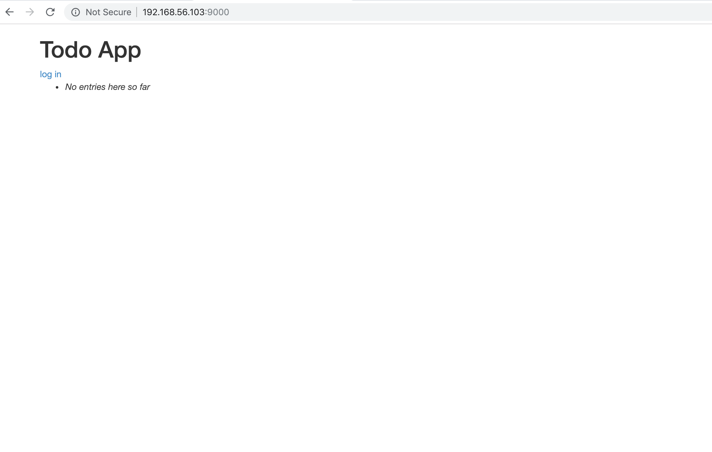

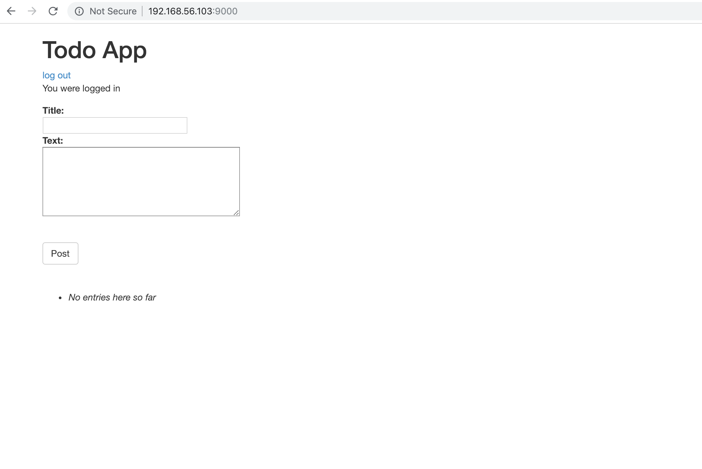

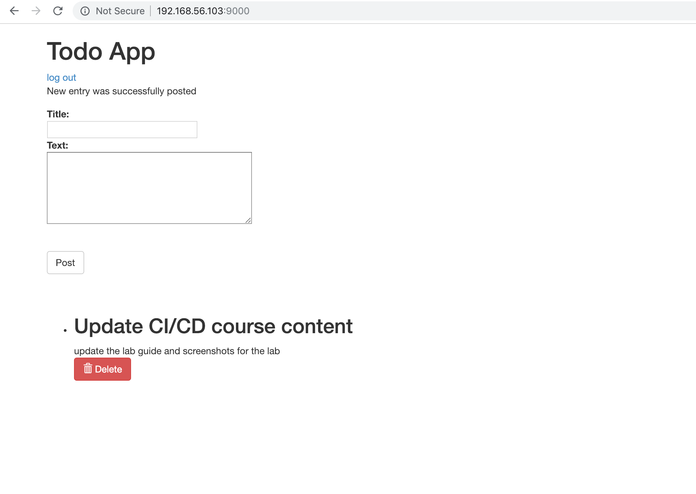

Once we make changes the application will look like this

<h2> Fork the demo application from Gtihub </h2>

1. Login to Github with your github account
2. Search for the `sabdhagiri/demo-app` repository
3. fork the repository into your github account

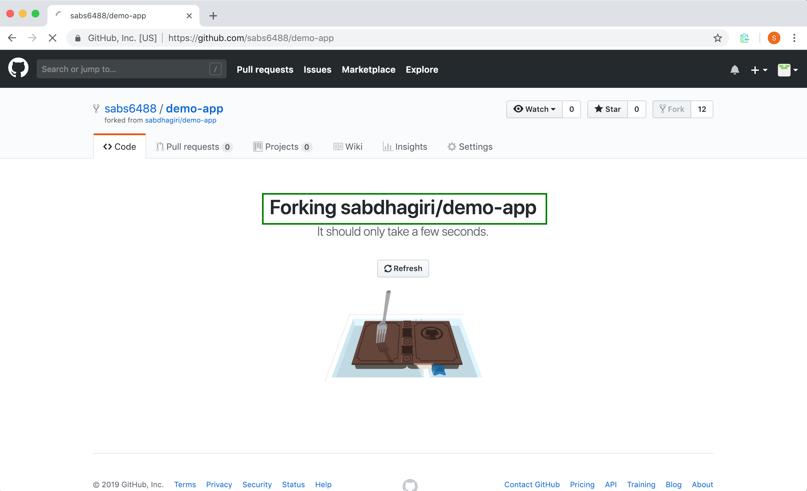

<h2> Clone the application from Github to local workstation </h2>

1. Login to the VM assigned to you, details will be in the POD details page.
2. Goto github and get the URL of the repository which you will be cloning here. Copy it to clipboard by clicking on the copy-to-clipboard  button near clone or download option.
3. On your vm execute the following command to clone the code repo, be sure to replace `sabs6488` with `<your-github-handle>`

	~~~bash
	git clone https://github.com/sabs6488/demo-app.git
	~~~
	
4. This should create a local working tree under the directory from which you cloned the code and you should be able to see the `demo-app` directory

<h2> Build and run application </h2>

1. This section is to get yourself familiar with some of the docker commands that will be used for the rest of the labs.
2. Login to your vm if you are not already in it.
3. execute the following command to check if you have access to the docker client
	
	~~~bash
	docker info
	~~~
	
4. This will show the system-wide information for the docker runtime.
5. build the docker image for the application using the Dockerfile shipped with the code repo using the following commands:

	~~~bash
	cd demo-app
	docker build -t demo-app:1.0 .
	~~~
	
6. This should build a new docker container image for the application and tag it as `demo-app:1.0`
7. This image can be seen when the following command is executed

	~~~bash
	docker images
	~~~
8. Now this image can be used to run an instance of the application by using the following command:

	~~~bash
	docker run -d --name demo-app -p 9000:9000 demo-app:1.0
	~~~
9. Now the application is running in a container and serving requests at `http://<your-pod-ip>:9000`

<h2> Process Overview </h2>

The objective of this course is to automate the above steps using tools like Gerrit, Jenkins, Docker and Github by using integration plugins and process pipelines.

When a new change is made to the development tree, it needs to be integrated to the master as and when it is tested and validated.

The typical flow will be as follows:

<h2> Setup Overview </h2>

For this course, Gerrit, docker and Jenkins have been pre-installed on the VM.

<h2> Gerrit bootstrap </h2>

1. Navigate to gerrit

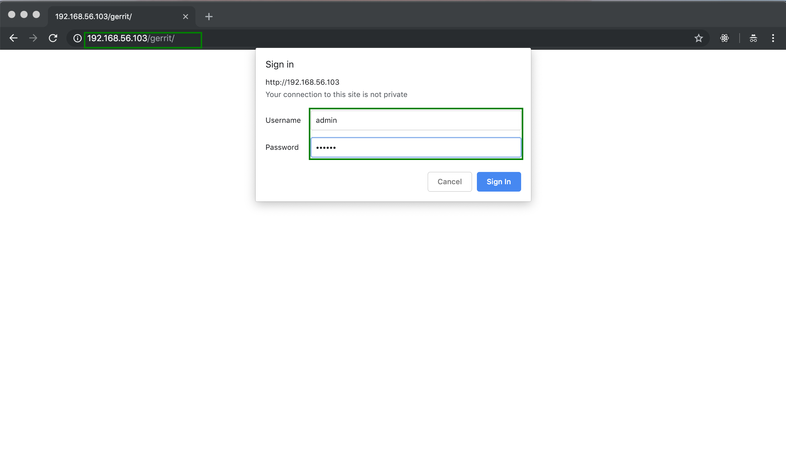

2. Configure admin user email

	

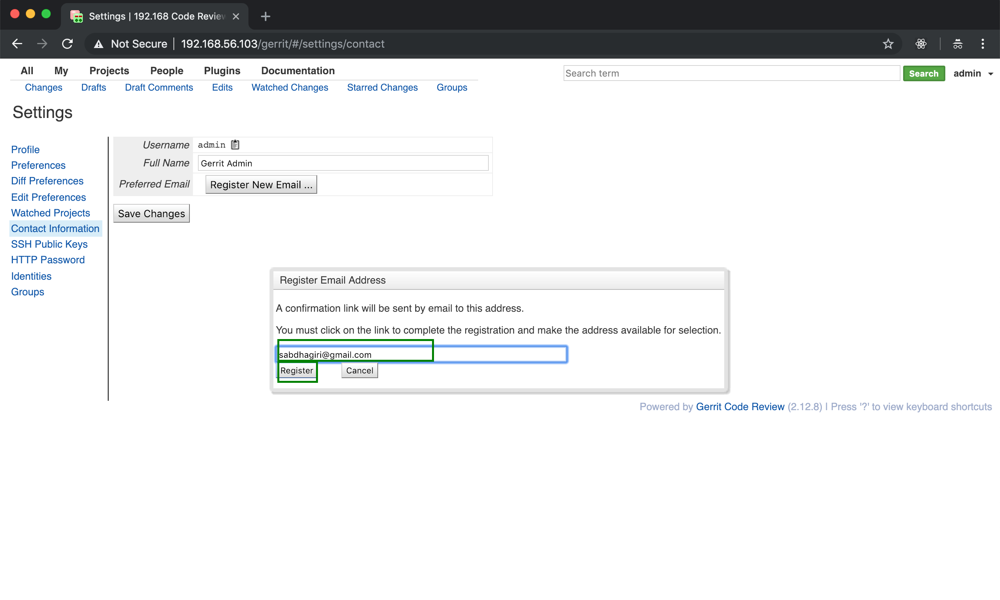

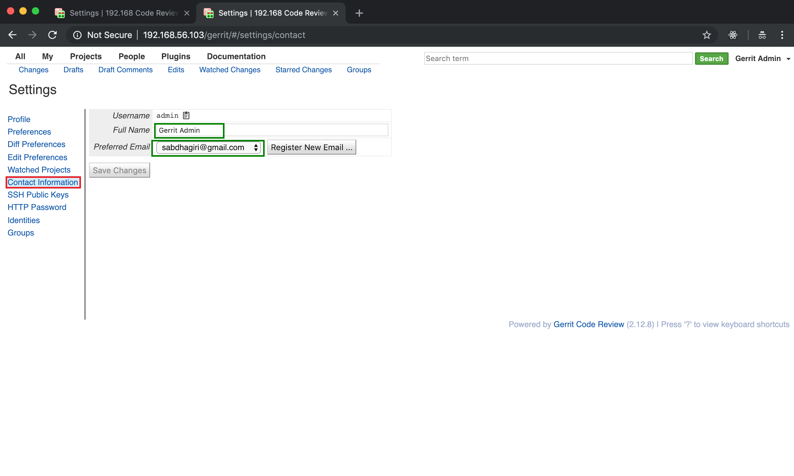

3. enable Verified label for all projects to be used by Jenkins

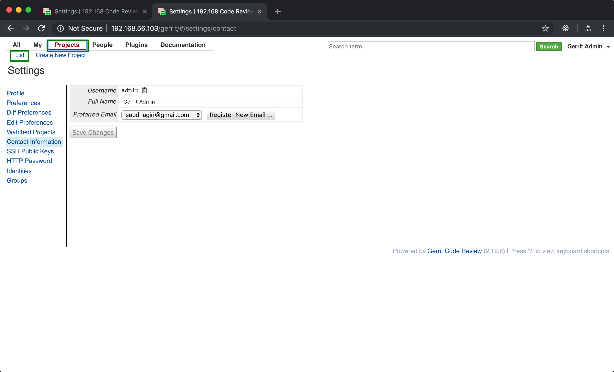

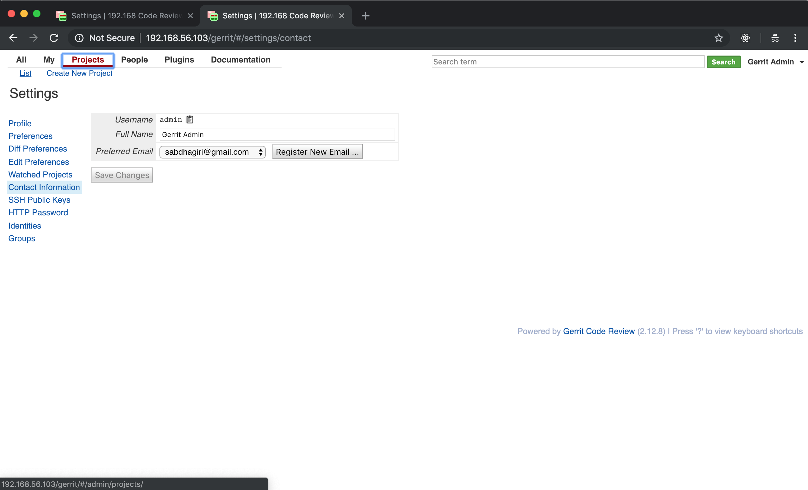

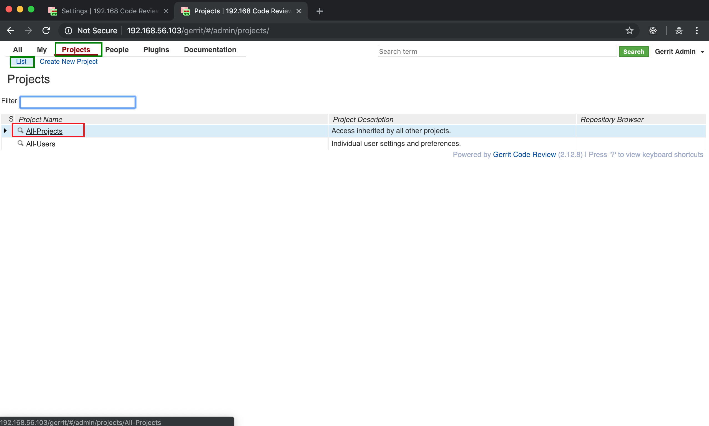

Add the follwoing code

	
	  [label "Verified"]
      function = MaxWithBlock
      value = -1 Fails
      value = 0 No score
      value = +1 Verified
      copyAllScoresIfNoCodeChange = true
	

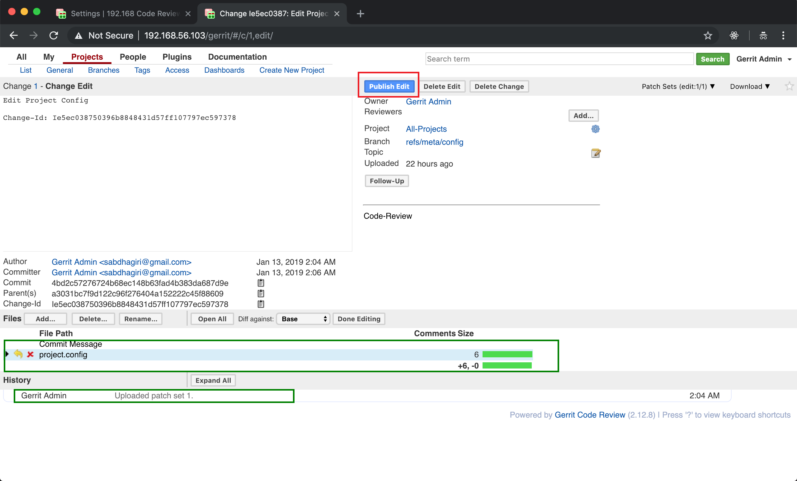

<h2> Bootstrap Jenkins </h2>

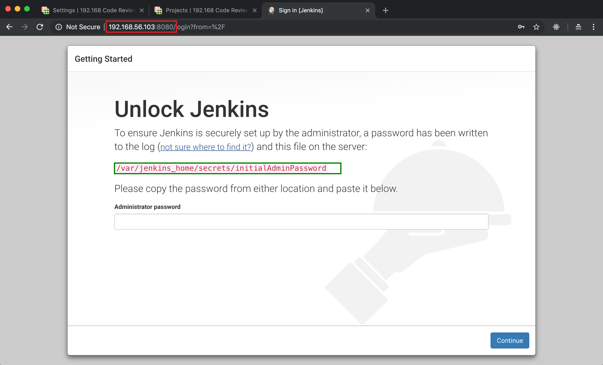

Get the initailAdminPassword from the jenkins container by executing the following command in the vm

~~~bash
docker exec jenkins cat /etc/jenkins_home/initialAdminPassword
~~~

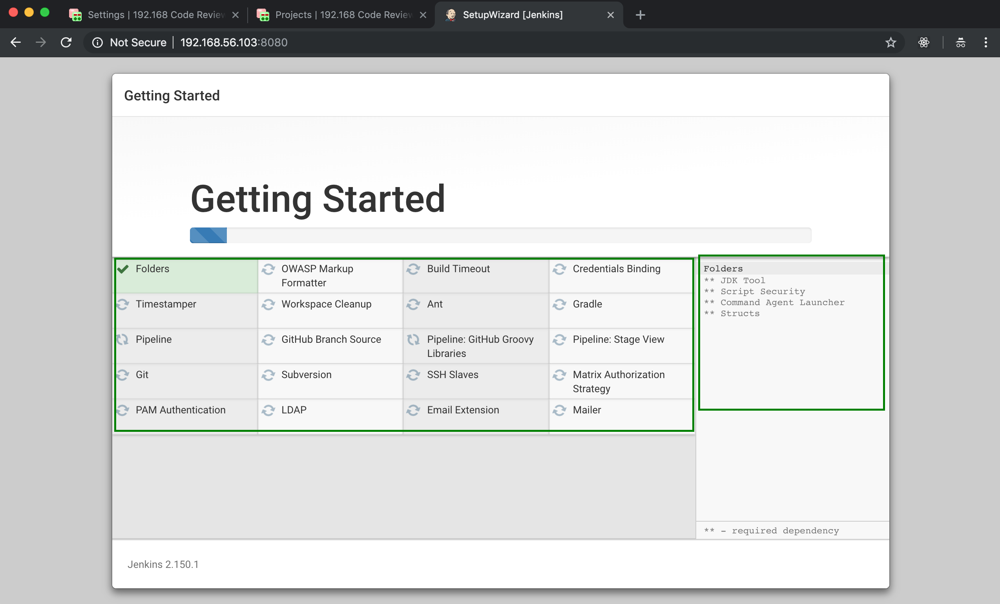

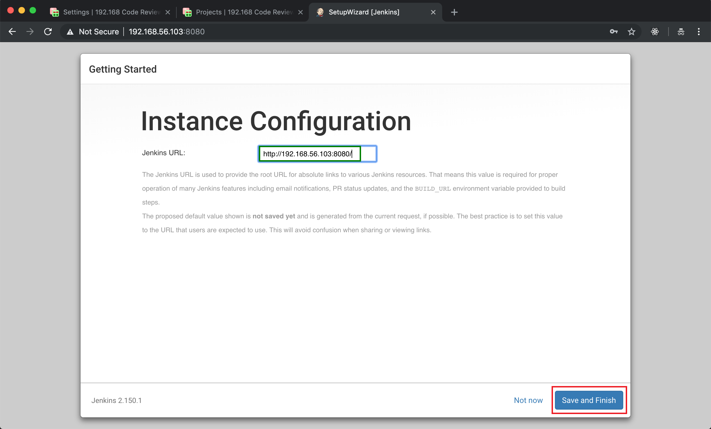

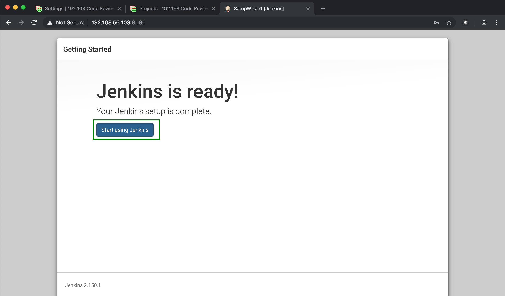
