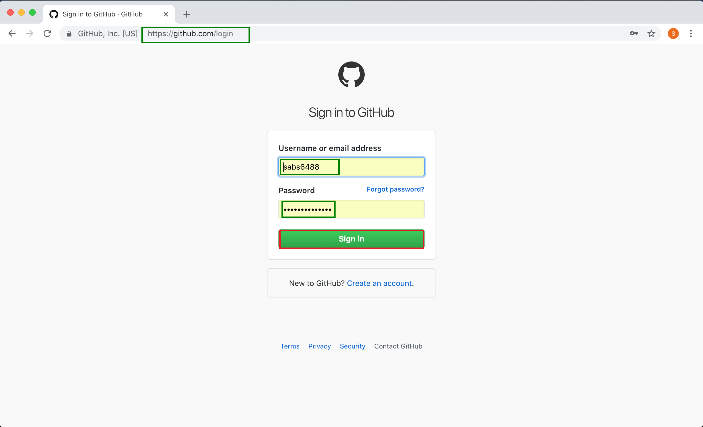
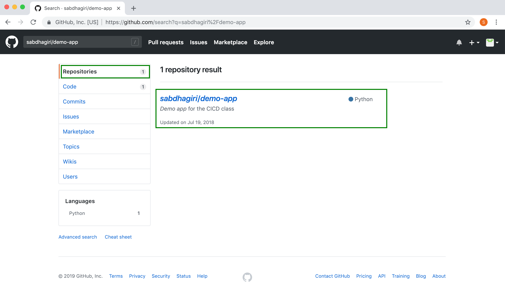
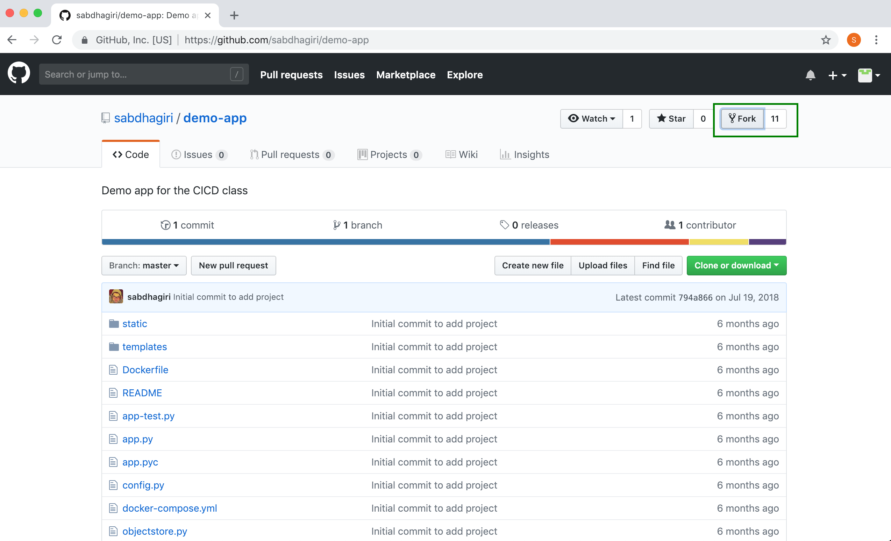

<h1> CI/CD lab guide </h1>

<h2> Introduction </h2>

For this course, one vm is being used as a all-in-one host. This VM is where the students will be:

1. Make development changes to the application code
2. Run Gerit
3. Run Docker runtime
4. Run Jenkins

<h4> Fork the demo application from Gtihub </h4>

1. Login to Github with your github account
2. Search for the `sabdhagiri/demo-app` repository
3. fork the repository into your github account

<h4> Clone the application from Github to local workstation </h4>

1. Login to the VM assigned to you, details will be in the POD details page.
2. Goto github and get the URL of the repository which you will be cloning here. Copy it to clipboard by clicking on the copy-to-clipboard  button near clone or download option.
3. On your vm execute the following command to clone the code repo, be sure to replace `sabs6488` with `<your-github-handle>`

	~~~bash
	git clone https://github.com/sabs6488/demo-app.git
	~~~
	
4. This should create a local working tree under the directory from which you cloned the code and you should be able to see the `demo-app` directory

<h4> Docker playground </h4>

1. This section is to get yourself familiar with some of the docker commands that will be used for the rest of the labs.
2. Login to your vm if you are not already in it.
3. execute the following command to check if you have access to the docker client

	~~~bash
	docker info
	~~~
4. This will show the system-wide information for the docker runtime.
5. 

<h4> Build and run the demo application on docker host </h4>
<h4> Navigate to the demo app </h4>

